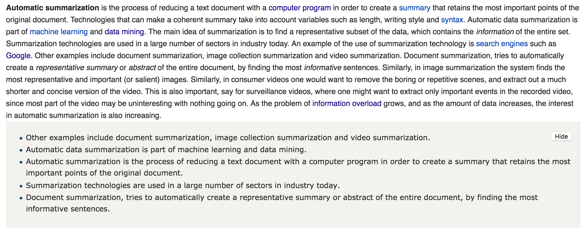

# Summarize Me

TODO: add our git links
Maintainer: [Vishnu Sarukkai, Melinda Wang and Alexandre Bucquet](https://github.com/samuelklam)

TODO: change summary and write up a detailed description
> A nifty Chrome Extension that provides a summary of the current web page or user selected text through a (right-click) context menu action.

## Examples
Browser Action


Context Menu


## Implementation
Summarize Me uses the [Text Summarization API](https://market.mashape.com/textanalysis/text-summarization) to extract and summarize important text from a URL or user selected text. Text Summarization uses Natural Language Processing and Machine Learning technologies to process text.

This chrome extension also dabbles with [IBM Watson Developer Cloud](https://www.ibm.com/watson/developercloud/alchemy-language.html) to provide sentiment analysis of the current page.

## Test Chrome Extension
To load Summarize Me, run ```npm install```, go to chrome://extensions, enable Developer mode and load the app as an unpacked extension. Note: you will need to register and use your own API key from [Mashape](https://market.mashape.com/textanalysis/text-summarization).

To experiment with the Alchemy API, run ```npm start``` to start the server.

## Contributing
External contributions in the form of feedback, bug reports or pull requests are always welcome!
