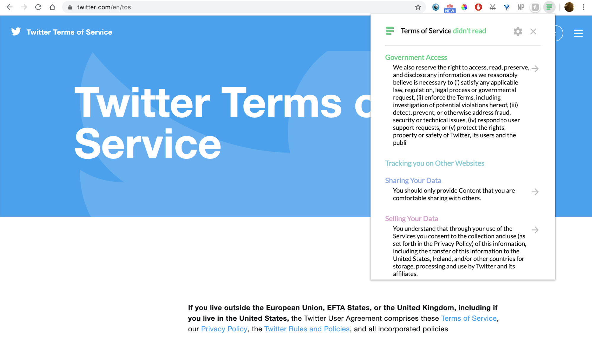
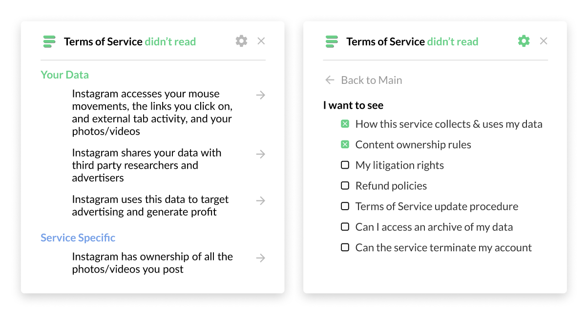

# Terms of Service Summary

Maintainers: [Vishnu Sarukkai](https://github.com/VSAnimator), [Melinda Wang](https://github.com/melywang),  [Alexandre Bucquet](https://github.com/abucquet)

> A Chrome extension that extract a few important sentences from a Terms of Services/Terms of Use page.

This chrome extension uses pattern matching to surface sentences related to different areas of Terms of Services. Currently, the extension supports five categories:

- Government: whether or not the service will give governments access to user accounts/data.
- Tracking: whether or not the service will track users on third-party websites.
- Share: to what extent the service will share user data.
- Sell: whether or not the service will share user data with third party websites.
- Copyright: who owns user data on the service.
- Court: what rights users/the service have to go to court and how disputes will be settled.

## Examples
Browser View


Pop-Up Menus


## Implementation
Terms of Service Summary uses regular expressions to surface relevant sentences after parsing the page. The only package dependencies are [JQuery](https://jquery.com/) and [Mark.js](https://markjs.io/).

## Test the Chrome Extension
To load this extension, run ```npm install```, go to chrome://extensions, enable Developer mode and load the app as an unpacked extension. Note: you can also access this extension on the Chrome store using this link (app is unlisted, still in beta phase).

## Other resources
## TODO: add link for our post
For more information, feel free to go check out our [Medium Post](), or this [explanatory video](https://vimeo.com/425369454).

## Contributing
External contributions are most welcome! We always are looking to find more categories that will be useful for our users, tune our current pattern-matching pipeline, and most importantly hear about bugs you might find. 
